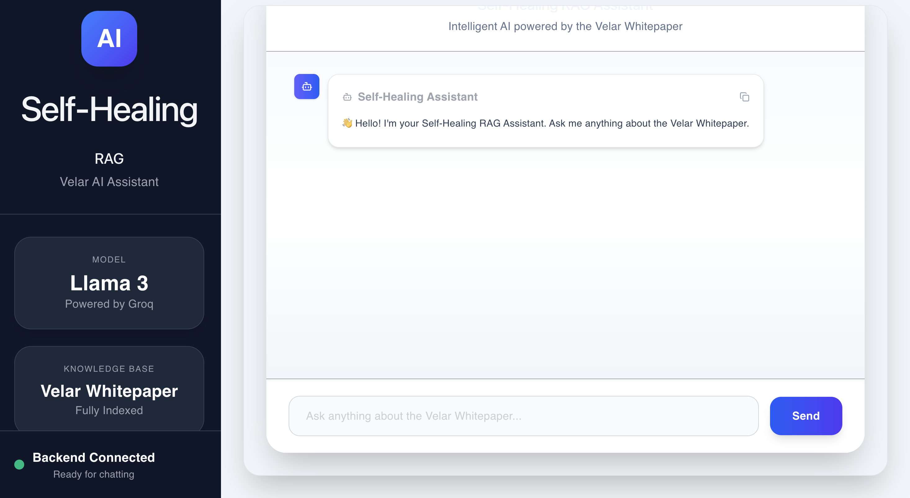
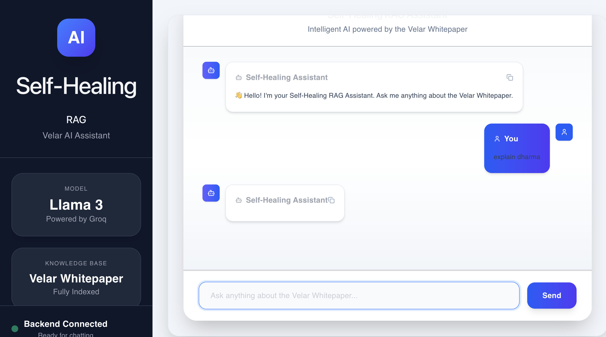
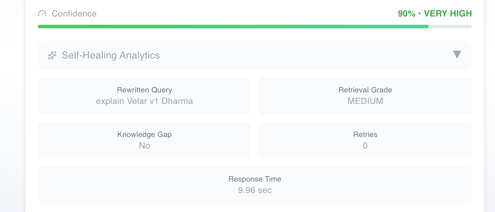

# 🚀 Self-Healing RAG System

An intelligent Retrieval-Augmented Generation (RAG) system that automatically improves retrieval quality through query rewriting, retrieval grading, reranking, confidence scoring, and knowledge-gap detection.

---

## 🌟 Overview

This project implements a **Self-Healing RAG pipeline** that continuously improves retrieval quality before generating responses.

Unlike traditional RAG systems, this application evaluates retrieved documents, rewrites poor queries, retries retrieval when necessary, reranks documents, detects knowledge gaps, and provides a confidence score with analytics for every response.

---

## ✨ Features

- 🔍 Query Rewriting
- 📚 Chroma Vector Database
- 🧠 Retrieval Grading
- 🔁 Automatic Retry Engine
- 📈 Confidence Scoring
- 🚨 Knowledge Gap Detection
- 🎯 Document Reranking
- 💬 Chat History
- 📄 Source Attribution
- 📊 Analytics Dashboard
- ⚡ Streaming Responses
- 🤖 Groq LLM Integration

---

## 🏗 Architecture

```text
                 User Query
                      │
                      ▼
             Query Rewriter
                      │
                      ▼
          Vector Retrieval (ChromaDB)
                      │
                      ▼
            Retrieval Grader
                      │
        ┌─────────────┴─────────────┐
        │                           │
     Good Retrieval          Poor Retrieval
        │                           │
        ▼                           ▼
    Document Reranker        Retry Engine
        │                           │
        └─────────────┬─────────────┘
                      ▼
          Knowledge Gap Detector
                      │
                      ▼
           Confidence Engine
                      │
                      ▼
                Groq LLM
                      │
                      ▼
    Answer + Sources + Analytics
```

---

## 🛠 Tech Stack

### Backend

- FastAPI
- LangChain
- Groq LLM
- ChromaDB
- Sentence Transformers

### Frontend

- React
- TypeScript
- Tailwind CSS
- Vite

---

## 📂 Project Structure

```
backend/
frontend/
data/
docs/
logs/
```

---

## ⚙ Installation

### Backend

```bash
cd backend
python -m venv .venv

# Windows
.venv\Scripts\activate

# macOS/Linux
source .venv/bin/activate

pip install -r requirements.txt

uvicorn app.main:app --reload
```

---

### Frontend

```bash
cd frontend
npm install
npm run dev
```

---

## 📸 Screenshots
### 🏠 Home Page


---

### Chat Interface


---

### Analytics Panel

---
### Sources


---

## 🚀 Future Improvements

- Hybrid Search
- Multi-agent RAG
- Evaluation Pipeline
- Docker Deployment
- Kubernetes Deployment
- Authentication
- Feedback Loop

---

## 👨‍💻 Author

**Raj Padhi**

GitHub: https://github.com/padhiraj